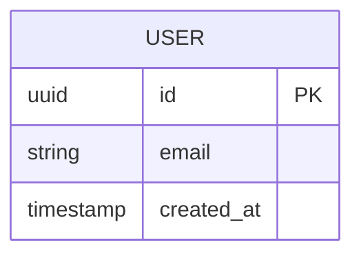
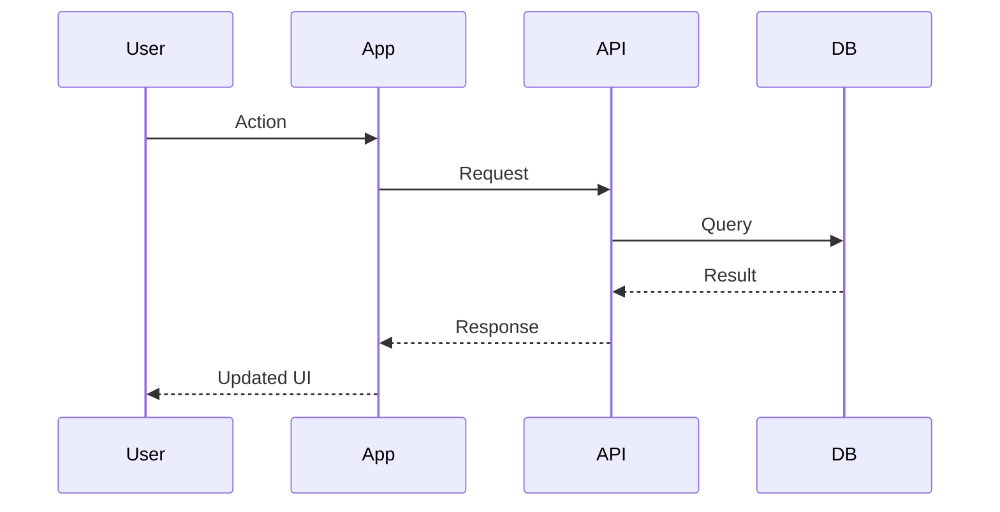

# spotdl-wrapper -- SPEC

> Fill this in before creating any tickets. Agents and contributors read this as the authoritative project description.

---

## Goal

<!-- One paragraph. What is this and why does it exist. -->

---

## Users

<!-- Who uses it and what do they need. -->

---

## Commands

<!-- List every CLI command or API endpoint with a one-line description. -->

| Command / Endpoint | Description |
|--------------------|-------------|
| ... | ... |

---

## Architecture

### Backend

- Language: Python
- API style: REST
- Auth: Supabase Auth (JWT validation)
- Deploy: Coolify (Docker, self-hosted)

### Data

- DB: Supabase (Postgres)
- Storage: Supabase Storage
- Migrations: Supabase CLI

### Infrastructure

- CI: GitHub Actions (lint, type check, build, test)
- Secrets: GitHub repository secrets
- Environments: preview (PR) + production (main branch)

---

## Data Model

<!-- Key entities and relationships. -->

---

## Flows

<!-- Critical user flows. -->

---

## Non-functional Requirements

- Performance: ...
- Security: ...
- Platforms: ...

---

## Design

<!-- Mermaid diagrams above are sufficient for non-UI projects. -->

---

## Out of Scope (MVP)

<!-- Explicitly list what is NOT being built in v1. -->

- ...
